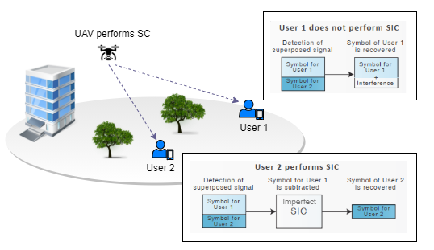

# System Model of UAV-NOMA System with Two-users

[](https://travis-ci.org/github/limabrena/uavnoma)
[](https://codecov.io/gh/limabrena/uavnoma)

A Python 3.8 implementation of the System Model of Unmanned Aerial Vehicle with Non-Orthogonal Multiple Access (UAV-NOMA) System and 2 ground users under considerations of non-ideal conditions, such as imperfect successive interference cancelation (SIC) and residual hardware impairments (RHI). We consider a uplink UAV-aided NOMA network, as illustrated in the figure below.




## Features

The **uavnoma** package allows the user to study the modeling of a UAV-NOMA network and use it as a basis for implementing other technologies. This application can be used as a study tool to understand the behavior of the achievable rate by two users and the influence of the allocation of power coefficients in a UAV-NOMA system under non-ideal conditions. The communication model presented is a base of UAV-NOMA principles and can be expanded to several other scenarios, such as cooperative systems, full-duplex communication,  and others in order to improve system performance.

The user can modify parameters and analyze the system's behavior. Based on this, new methods can be proposed to solve UAV trajectory problems, power allocation, user pairing, energy harvesting for UAV maintenance, decoding order and others.


The package contains functions:
- To calculate the position of the UAV and users
- To generate the channel gain between UAV and users
- To calculate of the Signal Interference Noise Ratio (SINR) 
- To analyze system performance using as metrics the instantaneous achievable rate and outage probability.

## Requirements

The implementation requires Python 3.8+ to run.
The following libraries are required:

- `numpy`
- `matplotlib`

## How to install


To install the *uavnoma* package, running the following command:

```
$ pip install uavnoma
```

### From GitHub
```
$ 
```
## Documentation 

* [*uavnoma* package documentation](https://github.com/limabrena/limabrena.github.io/blob/main/uavnoma/docs/index.html)
* [Developer's guide](doc/installationgruide.md)
* [Tutorial for the uavnoma functions](example/uavnoma_tutorial.ipynb)
* [Scenario Description](doc/documentation.md)

## License

[MIT License](LICENSE.txt)
