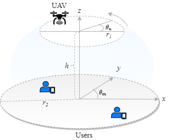

## Power Allocation in UAV-NOMA System with Two-users

A Python 3.9 implementation of the Power Allocation Algorithm for UAV-NOMA System with 2 Users. 
Numerical results are presented. 

---------------------------------
### How can use this application? 

- Download:

     Cloning the repository via terminal:
	 
		 $ git clone https://github.com/limabrena/power-allocation-UAV-NOMA-two-users.git

		
     Download ZIP file directly in my git repository:
	 
	      https://github.com/limabrena/power-allocation-UAV-NOMA-two-users/archive/main.zip
		  
	  
- Usage: 

	This application can be used as a study tool to understand the 
	behavior of the achievable rate by two users and the influence
	of the allocation of power coefficients in a UAV-NOMA system. 
	The communication model presented is a base of UAV-NOMA principles and 
	can be expanded to several other scenarios, such as massive MIMO, 
	full-duplex communication, and others in order to 
	improve the users' rate performance.
		
	The user can modify parameters and analyze the system's behavior. 
	Based on this, new methods can be proposed to solve trajectory problems, 
	power allocation, decoding order and others.
	
	Example: when the Rician Factor `K=0`, fading is similar to Rayleigh's.
	
----------------
### Documentation

To generate source code documentation, in the folder `pa-uav-noma`run: 
	
	 pdoc3 --html --output-dir docs pa-uav-noma.py
		
To access the documentation via http://localhost:8080, run:

	 pdoc3 --http : pa-uav-noma.py
	 
On the other hand, the documentation can be viewed at [Documentation](https://limabrena.github.io/docs/pa-uav-noma.html).
 
----------------
### Requirement

The implementation requires Python 3.9+ to run.
The following libraries are required:

 - `numpy` 
 - `matplotlib.pyplot`
 - `math`
 - `random`

-------------------------
### Scenario Description

We consider a uplink UAV-aided NOMA network, as illustrated in figure below. 

In this scenario, a UAV is deployed as an air base station that communicates with two-user $N_1$ and $N_2$.  
For each Monte Carlo sample, users are randomly distributed in a 2D region (x-axis and y-axis). 
While the UAV has a flight path randomly defined at points in a circle, in a 3D region (x-axis, y-axis and z-axis).
We consider that each node is equipped with a single antenna and both UAV and users operate in the half-duplex mode.
The system is inspired on cognitive radio (CR) concept to decode the user's messages.
Based on this, the user $N_1$ is viewed as the primary user and $N_2$ is viewed as secondary user.
In order to guarantee primary user's Quality-of-Service requirements, the UAV first decodes the $N_1$'s message.
Then, the UAV decodes the message from the secondary user $N_2$ without experiencing any performance degradation due to the primary user.

*Example:*

	 $N_1$ may be an Internet of Things (IoT) healthcare device which needs to send health status changes.

	 $N_2$ an IoT device sending personal tasks records, where the transmission is a delay tolerant.

Different levels of power coefficients must be allocated to each user's signal, so that users' QoS requirements are satisfied.

 
-------------------------------
## Performance analysis metrics
The outage probability and achievable rate are used as performance metrics. 

- `Outage Probability:` the outage probability is estimated as the ratio between the number of outage events and 
   the total number of Monte Carlo repetitions. An outage event happens when the supported user data rates for a particular 
   instantaneous channel realization is less than the target data rate. 
   
- `Achievable Rate:` the achievable rate consists of the throughput of network users, while max-min achievable rate 
   consists of the average throughput of all network users.
   
-------------------------
### Algorithm description

Adaptive power allocation algorithm was not implemented in the present version.

